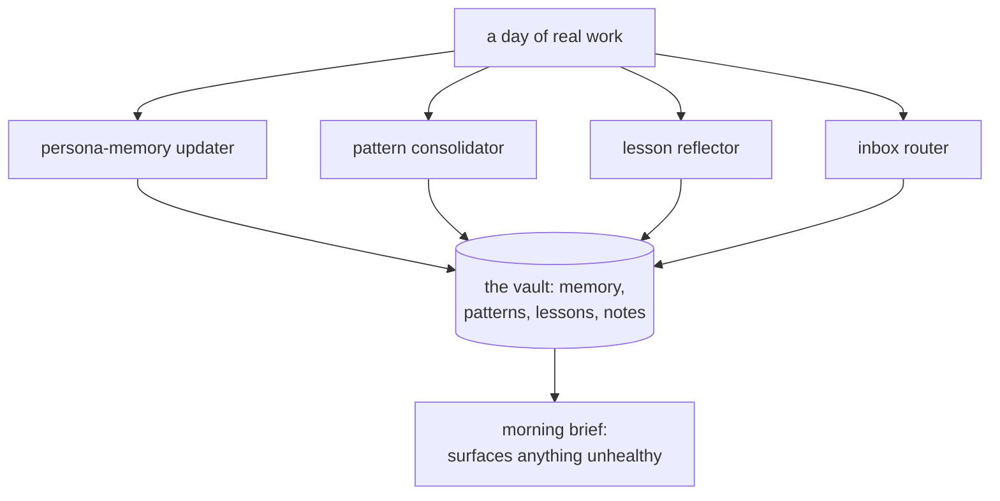

<!-- source_session: 2026-07-25_learning-loop-restore -->

# The Health Check Was Reporting to a File Nobody Read

*2026-07-25 · product, ai-agents, observability, systems · Silent Failures*

Here is a failure mode that should scare any product person more than a crash: the system is broken, and every signal you built to tell you so is reporting green. A crash pages you. A silent failure lets you keep believing the thing works, and quietly compounds the damage for as long as you are not looking. This week I found one in my own setup, and the most useful part was not the bug. It was why my instrumentation failed to catch it.

The product in question is small and personal, but the lesson is not. I run an AI setup that is supposed to get a little smarter every night. A handful of scheduled jobs read the day's work and fold what they find back into the system: they update the memory that shapes each assistant role, consolidate recurring patterns, grade which past lessons actually helped, and file the notes I captured during the day. That nightly loop is the entire reason the system does not repeat itself.

It had stopped. Not loudly. The assistants just kept making the same corrected mistakes, the ones the loop was supposed to have learned its way out of. When I finally opened the hood, I found three separate bugs. Not one of them had thrown an error, and the third one is the reason the first two survived for as long as they did.

---

## The setup, in one picture

Four jobs run on a schedule against my vault, which is a single folder of Markdown files that acts as the system's working memory:

The morning brief at the bottom is the safety net. Every job appends a status line to a health log, and the brief reads that log first thing and puts any warning in front of me. That is the whole contract: the jobs report, the brief surfaces, I act. Remember that contract, because it is where the story breaks.

## Bug one: a placeholder that exited clean

The inbox router is the job that files the notes I tag during the day. Its main step was a single command: `true`.

`true` is the shell command that does nothing and succeeds. A comment above it was honest about the intent: the real work had supposedly moved elsewhere during a migration, and this was a temporary no-op standing in until the rebuild landed. The temporary had quietly become permanent. Every night the job started, ran `true`, exited zero, and filed nothing. From the outside it looked like a healthy job with nothing to do. From the inside it was unplugged and smiling.

## Bug two: a model name that no longer existed

All four jobs called the same model by an identifier that had been retired. It was not a slower model or a cheaper one. It was a name that no longer pointed at anything.

A retired model name does not degrade politely the way a smaller model does. The call simply fails. But a job that fails at two in the morning does not wake you up. It writes a line to a log and exits, and the only way you ever learn about it is if something reads that log and tells you. Which brings us to the bug that made the other two invisible.

## Bug three: the health log was written where nobody reads

Every job appends a status line when it finishes, saying it ran and what happened. That is the exact signal that should have caught bugs one and two. A stubbed job and a dead model name would both leave a trail here, and the brief would surface it in the morning.

Except there were two health files, not one. The jobs were appending their status to a log file that sits next to their own scripts. The morning brief reads a different health file, the one inside the vault. Somewhere in a past reorganization the writers and the reader drifted onto two files with the same name in different folders, and nothing connected them again.

So the safety net was real. The jobs were faithfully writing to it. The brief was faithfully reading from it. And the two were pointed at different drawers. The monitor built to catch silent failures was itself a silent failure, dutifully recording the truth into a file no one ever opened.

## The fix

The repair was smaller than the diagnosis, which is usually the case.

I brought all four jobs back under one local orchestrator that runs them in sequence, so there is one owner of the schedule and one log to read. I deleted the `true` and restored the router's real work. I replaced the retired model name with the current one in every job. And I repointed every job's health line at the vault file, the one the brief actually reads, with a fallback to the local file only if the vault write ever fails.

Then I refused to trust that on faith. I pulled the health-writing function straight out of each of the four scripts, ran the real code, and watched: all four status lines landed in the vault file the brief reads, none fell back, and the file was left exactly as it started once I removed the test lines. The signal now arrives where the reader is standing.

---

## What I am taking from it

**A green light is a claim, not proof.** An exit code of zero means the process finished, nothing more. My stubbed job exited zero every night while doing nothing, and it looked identical to a job that ran perfectly. If you cannot tell "it worked" apart from "it did nothing" by looking at your dashboard, your dashboard is measuring the wrong thing. Instrument the outcome you actually care about, not the fact that the code reached the end.

**A monitor is not done when it writes the truth. It is done when the truth reaches a reader.** This is the one that stung. My health check was correct, complete, and useless, because it was writing to a place with no audience. A signal nobody reads is not observability. It is a diary. When you build any alert, dashboard, or health check, trace it all the way to the human or system that acts on it, and prove the last hop works. Coverage you never verified end to end is just the feeling of coverage.

**Migrations rot in the seams, not the center.** None of these three bugs was in the hard part. They were in the joints of a past move: a placeholder that was honest the day it was written and became a lie when the rebuild never landed, a version pin that was correct when typed and went stale when the world moved on, a signal that was connected to its reader until a reorganization quietly separated them. Every one was true at the moment of the change and false by the time it mattered. After you move something, audit the seams, because that is where the quiet failures live.

The reassuring part is that every cause was boring and findable. When a system feels like it has stopped compounding, resist the tempting story that the model got worse. Open the jobs, read what they actually run, and follow each signal all the way to whoever is supposed to read it. The bug is almost always in a seam, and seams do not raise their hand.

---

## Related

- [My AI Agents Got Dumber. It Was Not a Model Downgrade.](why-my-agents-got-dumber.md): the first time this exact symptom sent me into my own setup instead of blaming the model. That cause was token optimization trading away intelligence. This one was a migration leaving dead seams.
- [Every Status Was Green. Three of Them Were Lying.](every-status-was-green.md): the same lesson from the other side. There a status said "ok" over failed work. Here the status was perfectly honest and pointed at a file no reader opens.
- [launchd and iCloud: The Silent Block That Stopped Every Scheduled Agent](launchd-icloud-silent-block.md): the earlier chapter of this same scheduled-agent layer, where these jobs were relocated in the first place. This post is what rotted in the seams of that move.
- [I Was Burning 18 Claude Sessions a Day. Here Is What Found Them.](token-burn-audit.md): five other silent bugs in this same automation layer, each invisible because it was a missing signal rather than a raised error.

---

*Building in public from an Obsidian vault. I am Anmoll, a product manager who ships products using AI tools. [All posts](../README.md)*
