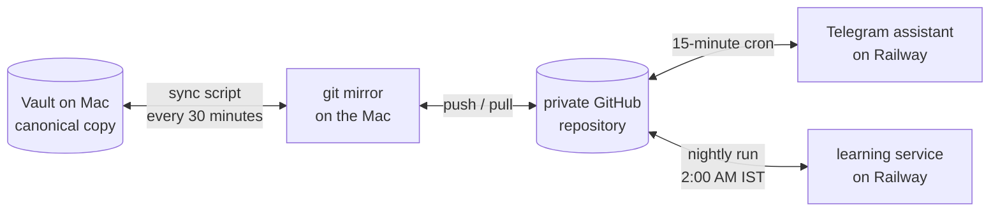
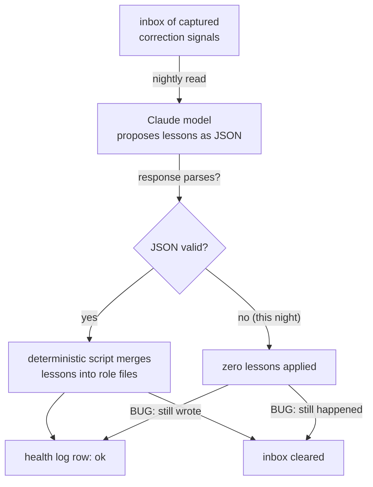
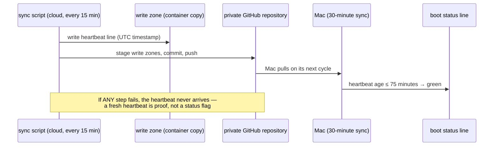

<!-- source_session: 2026-06-12_vault-os-loader-v2-gateway-writeback -->

# Every Status Was Green. Three of Them Were Lying.

*2026-06-12 · vault, ai, systems, debugging · Vault as OS*

I spent one day adding a live status line to my knowledge system, and it immediately surfaced three failures that had been hiding behind green checkmarks — including a sync job that had reported success sixty-six times in a row while never once doing its job. This post explains how the system fits together, and what the day taught me about the difference between a process that exits cleanly and a process that actually worked.

## Context: one vault, five nodes

My entire working memory lives in one folder of Markdown files — an Obsidian vault on my Mac. Everything else in the system is a derived copy of that folder, connected by git through one private GitHub repository:

Two cloud services hold their own copy. The first is a Telegram assistant I can message from my phone; it pulls the vault every fifteen minutes and is allowed to write into a small set of folders it owns — an inbox for captured notes, reminders, content drafts. The second is a nightly learning service: it reads correction signals that hooks captured during my working sessions, asks a Claude model to propose lessons, and a deterministic script merges those lessons into per-role instruction files. The model proposes; the script disposes. No copy ever has two writers for the same path, which is why nothing ever merge-conflicts.

Every Claude Code session on the Mac boots with context assembled by a hook: my goals, what is in flight, known broken things, and the hard rules the system has learned. That boot payload is where this story starts.

## The new status line

The boot context told me what I was working on, but not whether the machinery underneath was actually running. So I added a status section that performs live local checks at session start: how old is the last mirror push, did the nightly learning run happen, did the capture hooks fire today, are the scheduled jobs done, and is the Telegram assistant alive.

The principle behind it comes from a rule the system itself had already learned and written down: an exit code is a claim, not proof. A job can exit cleanly with empty or wrong output. The status line was supposed to check outcomes — file ages, row dates, commit existence — rather than whether something ran.

It worked on the first boot. Just not the way I expected.

## Failure one: my own alert was wrong

The first thing the new status line told me was that the nightly learning run had been missed. It had not. The health log that the cloud service writes uses Coordinated Universal Time (UTC), because that is the container clock. My check compared those timestamps against Indian Standard Time (IST), which sits five and a half hours ahead. The run had fired exactly on schedule — 2:01 AM IST — and my check read it as missing.

The uncomfortable part: the system had already learned this exact lesson the previous day, in a different context, and recorded it in its memory files. I had read that lesson during the session and still wrote a timestamp comparison in the wrong timezone. Reading a lesson is not the same as applying it. The fix was mechanical — anchor every timestamp comparison in the writer's clock, not the reader's — but the false claim had already propagated into five different records before I caught it, and each one had to be corrected.

## Failure two: the run that said "ok" while deleting its own input

Investigating the false alarm meant reading the actual logs from the cloud service. The nightly run had fired on time — but inside it, the Claude model's response had failed to parse as JSON. The run applied zero lessons, spent about twenty-four cents on the model call, and then did something genuinely destructive: it cleared the inbox of capture signals anyway, deleting three files of raw learning material that had produced nothing. The health log recorded the whole thing as "ok".

Three separate fixes came out of that one log line. The parser now attempts to extract a JSON object from a prose-wrapped response before giving up. A genuine parse failure now logs the length and shape of what the model actually returned, because a failure you cannot inspect is a failure you cannot fix. And most importantly, a parse-failure night no longer touches the inbox, and no longer reports "ok" — the status field now tells the truth, which means the boot status line catches it the next morning.

## Failure three: sixty-six successful syncs that synced nothing

To make the Telegram assistant's health visible, I added a heartbeat: the sync script writes one line — a UTC timestamp — to a file inside its write zone before committing. The design property I wanted was that the heartbeat could only arrive on my Mac if the entire chain had genuinely worked: commit, pull, push, my Mac syncing it back down. A fresh heartbeat would be proof, not a claim.

The heartbeat file appeared in the container. It never appeared on GitHub. That was the thread that unravelled the third failure: the assistant's sync job had completed sixty-six runs, every one logged as "sync ok", and had never pushed a single commit. The cause was a git behaviour I did not appreciate until it burned me: staging multiple paths in one command is all-or-nothing. Three of the five folders in the staging command did not exist yet, because nothing had written to them. Git rejected the entire command every time, the error went to a silenced error stream, pushing nothing "succeeded", and the log said ok.

The fix was a three-line loop — stage each path individually and let missing ones fail alone. On the next fifteen-minute tick, the first real commit from the assistant landed on GitHub, carrying the heartbeat. Six minutes after my Mac pulled it down, the boot status line showed the assistant green — this time with evidence behind the colour.

## What I Learned

**A success message must attest the outcome, not the exit.** "Sync ok" meant "the commands ran without a non-zero exit code". It should have meant "this many files reached the remote". Every silent failure in this story passed through a log line that was technically true and practically false.

**Health checks belong to the writer's clock and the schedule, not to file age.** A check that asks "did something run recently" is satisfied by the wrong thing running. A check that asks "did the 2:00 AM run produce its row, in the timezone the row is written in" is not.

**Proof-carrying signals beat status flags.** The heartbeat worked precisely because it could not exist without the thing it attested. When you design monitoring, prefer signals that are physically impossible to fake over fields that something has to remember to set correctly.

## Related

- [The Write-Only Trap](the-write-only-trap.md) — the next layer after observability: once the system can monitor itself, it can also synthesize behavioral patterns from its own tool-use logs; the proof-carrying-signal principle here applies directly to the observation synthesis watermark and health log
- [Your Agents Are Only as Good as the Context You Program Them With](context-is-the-program.md) — the earlier overhaul that moved this system's rules from prose into enforced hooks; this post is what its monitoring layer grew into
- [Append-Only Is Where Lessons Go to Die](append-only-is-where-lessons-go-to-die.md) — how the nightly learning loop curates lessons instead of accumulating them; failure two in this post happened inside that loop
- [Claude Appends Text After JSON: A Silent Bug Across 8 API Call Sites](claude-appends-text-after-json.md) — the same model-output parsing failure in a different system, and the same lesson: extract the JSON, never assume the whole string is valid
- [How My Hermes Agent Works — and What It Does for Me, From a PM's Point of View](building-a-personal-ai-ops-layer.md) — the Telegram assistant whose sync job stars in failure three
- [Why I Shut Down Hermes — a Multi-Agent AI System I Built Myself](why-i-shut-down-hermes.md) — the shutdown post that names the split-brain failure described here as one of five reasons the system was decommissioned; this post is the concrete incident behind that section
- [One Sheet I Can Trust](one-sheet-i-can-trust.md): the same green-is-not-proof lesson applied to a new system, where a contract eval's first act was catching a silent data coercion

---

*This post was distilled from a working session in my Obsidian vault. I build products with AI tools and write about the systems behind the work.*
