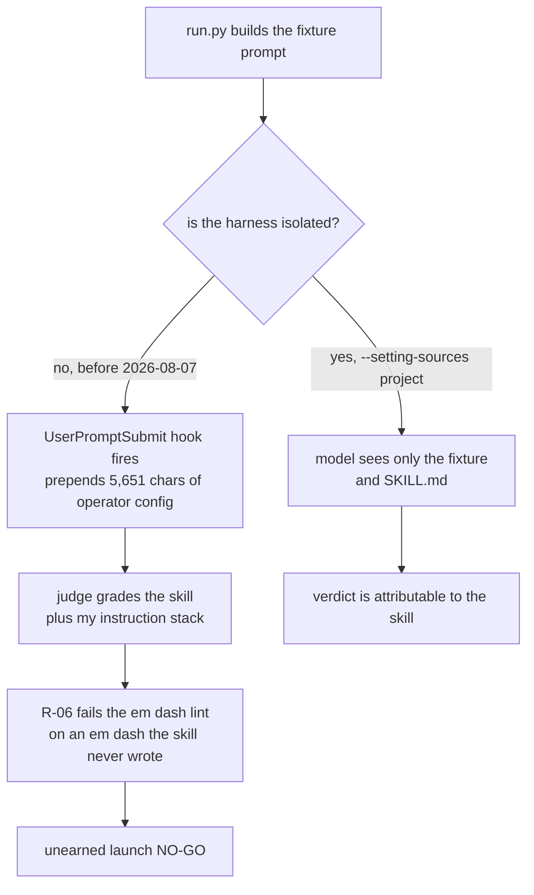

<!-- source_session: 2026-08-09_decoder-eval-hardening -->

# The Eval Was Grading My Config, Not My Skill

*2026-08-09 · ai, evals, claude-code, prompt-engineering*

Decoder is a free Claude Code skill that explains technical concepts to product managers. In run 12 of its eval suite, it failed a release-gate fixture on a banned character it had never written. The character was an em dash. The skill forbids em dashes in its own house rules, the lint checks for them mechanically, and one instance fails the whole answer.

The em dash was mine. It came out of my personal Claude Code configuration, which the harness was quietly feeding into every graded prompt.

That produced a launch NO-GO the skill had not earned, and it is the most useful thing the eval has found so far, because it was a defect in the measuring instrument rather than in the thing being measured.

## The harness was not isolated

Each fixture is answered by a `claude -p` subprocess. The thing I had not thought through is that this subprocess is an ordinary Claude Code session. It loads the operator's user settings. My settings register a `UserPromptSubmit` hook that prepends my global instruction stack to every prompt I submit, which is exactly what I want when I am working and exactly what I do not want when I am grading.

Measured on 2026-08-07 against fixture `R-06`: 5,651 injected characters inside an 18,134 character prompt. Thirty one percent of what the judge graded was my personal configuration rather than the skill under test.

The fix is two flags rather than a rewrite. `run.py` now passes `--setting-sources project` and runs the subprocess in an empty working directory, so neither user settings nor a stray project memory file get discovered.

The part worth copying is not the flags, it is the verification. I did not trust the flags because they sounded right. I diffed the session transcripts and looked for three markers that only my configuration produces: `DOC STANDARD`, `AUTO-ROUTE`, and `Lesson(s) applied`. With default flags all three appear in the transcript. With the flag, all three are absent. That is a falsifiable check on the isolation itself, and without it I would just be asserting a fix.

One gap is still open and I am writing it down rather than papering over it: I have not verified whether the user-level `CLAUDE.md` is still auto-discovered under these flags. The CLI help ties that file's auto-discovery to `--bare`, and `--bare` forces API-key authentication, which is unusable on a subscription. Until somebody measures it, the honest position is that the file probably still loads.

The general lesson is that an eval harness is a piece of production software with users, and its most dangerous failure mode is contaminating the input rather than crashing. A crash is loud. Contamination returns a plausible number, and a plausible wrong number is far more expensive than no number, because you act on it.

## Why ten out of ten is the wrong target

The instinct when a refusal fixture fails is to demand a perfect score before shipping. Refusals are the class that protects the reader from actual harm, so surely the bar is all of them.

The measurement says otherwise. Runs 11 and 12 are the only pair graded against a byte-identical `SKILL.md`, hash `bc98651970a5`. Across the 23 fixtures that both runs scored, 5 flipped verdict: `G-03`, `M-02`, `R-03`, `R-06`, `R-10`. That is a per-fixture flip rate of roughly 22 percent, with no change to the file at all.

Against that variance, a demand for 10 of 10 twice consecutively is not a high standard. It is an unreachable state. And an unreachable gate does not protect anything, because it never goes green, and a gate that never goes green eventually gets waived by whoever is shipping under time pressure. A bar that is quietly overridden is worse than a slightly lower bar that is actually enforced, because the first one also teaches the team that gates are decoration.

So the release gate is now: the refusal class scores 9 of 10 or better, on two consecutive runs, against the same `SKILL.md` hash.

Three details in that sentence carry the weight:

**Two consecutive runs.** At a 22 percent flip rate, a single green run is a coin landing the way you wanted. This rule also works in the other direction, and that is where it earned its keep. `R-04` and `R-10` both looked like genuine defects on the strength of one failing run each. Both turned out to be noise. Without the two-run rule I would have "fixed" two things that were never broken, which means editing a prompt to chase sampling variance, which is how a skill file accumulates rules that do nothing.

**The same hash.** A score against an unnamed version of the file is not comparable to any other score. Every published figure names the hash and states whether the harness was isolated.

**The refusal class specifically, and no overall percentage floor.** A single headline number across all 33 fixtures would be mostly sampling noise given the flip rate. Instead the suite holds two directional conditions: the always-fail set must not grow, and no fixture may leave the always-pass set. Direction survives noise. An absolute score does not.

That last decision is the one I would push hardest on if you are building something similar. There is enormous pressure to produce a single number, because a single number is quotable and a direction is not. I have no pass-rate percentage to put in a launch post, and that is the correct outcome rather than a missing feature.

**Update, measured 2026-08-10.** The rule I just described does not hold. Runs 25 and 26 are a byte-identical pair, hash `c26f00b2f0a8`, both graded on the isolated harness, both covering all 33 fixtures. Nine flipped, a per-fixture flip rate of 27 percent. Isolation did not reduce the variance, which settles the open question above: the 22 percent was model sampling and not injected text. The refusal class alone moved 9 of 10 to 7 of 10 on the same bytes, which is the finding with teeth, because it means the gate I just proposed sits inside the noise band. Clearing it twice is then partly a statement about sampling rather than about the file. Raising the bar does not fix that and lowering it does not either. What fixes it is grading each fixture several times per run and gating on the majority, so a verdict arrives as an estimate with an error bar instead of a single draw. That landed as a `--samples` flag.

I am leaving the section above standing rather than quietly rewriting it, because the sequence is the actual lesson. The two-run rule was a real improvement on a single run. It was still not enough. I only found that out by re-measuring something I had already written up as solved, which is the same move that produced the contaminated-prompt finding one section earlier, pointed at my own conclusion instead of my own harness.

## Subtraction beat addition, twice

Every version of this skill until recently was built by addition. A fixture fails, so a rule gets added to prevent that failure. It is the obvious move and it degrades the file.

Two things changed my mind, both measured.

The first was the changelog. The development history lived inside `SKILL.md` and had grown to 16 percent of the file. Because a skill file is force-loaded into context, that meant every prompt and every eval run carried a detailed record of the skill's own past defects. The skill was partly being graded on a list of things it used to get wrong. Moving the changelog to a separate `CHANGELOG.md` removed a sixth of the file and removed zero instructions, because none of it was ever an instruction to the model.

The second was `R-03`, the fixture covering documents the model was given but could not open. It failed three of four runs against an unchanged file, and each failure was a different sentence about a document the answer had never read: once its length, once its access control. The rule already banned exactly those things. It banned them across roughly 330 words of accumulated prohibitions.

That is the diagnosis worth carrying: the defect was not a missing prohibition. It was a wall of prohibitions with no shape to copy. A model reading 330 words of "do not say X, do not say Y" has to synthesise the safe output itself, every time, under whatever else is competing for attention in the context. The fix was to replace the prose with a short rule plus a literal template to copy. Compliance is far cheaper when the correct answer is sitting there to be imitated rather than derived from a list of exclusions.

Both fixes are the same move. When a prompt is not producing the behaviour you want, the reflex is to add a sentence. Very often the actual problem is that the relevant instruction is already in there, buried under the last six sentences somebody added for the same reason.

The pre-send checklist in the skill is the current instance of this. It grew to 12 binary checks across versions, which is long enough that reliable execution of all 12 on every answer is an assumption rather than an observation. It is now eight, and the line sitting under the list reads "Eight is a cap, not a count. Adding a check means removing one." The cap is the part worth copying. Without it the list regrows, because every future failure will again look like it is asking for one more check.

## What I would check in your harness

Three questions, in order of how much they have cost me:

1. What is actually in the prompt at grade time? Print it, count the characters, and confirm the count matches what you think you sent. Do not reason about it from the code.
2. Is your pass bar reachable given your measured variance? If you have not measured the variance, that is the first experiment, not the eval itself.
3. When a fixture fails, is your next move to add a rule? Check whether the rule is already there and simply losing a fight for attention.

The skill is free and open source at [thepmcode.com/decoder](https://www.thepmcode.com/decoder).

## Related

- [The Eval Agent: Adding a Quality Gate to an AI Workflow](the-eval-agent.md): the origin of this posture, where a separate agent was created because producing and evaluating have conflicting incentives. This post is what happens when you point that same suspicion at the evaluator itself and find it compromised.
- [Your Agents Are Only as Good as the Context You Program Them With](context-is-the-program.md): the same mechanism with the sign flipped. There, injected context is the feature that makes agents work. Here, the identical injection silently becomes 31 percent of a graded prompt.
- [I ran the stats hoping to prove it worked. It did not, and that was the deliverable.](null-result-was-the-deliverable.md): the companion discipline on reading results honestly. A 22 percent flip rate is exactly the condition under which a single run tells you nothing, and two fixtures here were nearly "fixed" on noise.
- [The Claims Were There. The Sources Were Not.](claims-without-sources.md): the provenance argument applied to a vault instead of an eval. A number without its hash and its isolation status is the same defect as a claim without its source.

---

*I am Anmoll, a product manager who ships products with AI tools and writes about the systems behind the work. [All posts](../README.md)*
