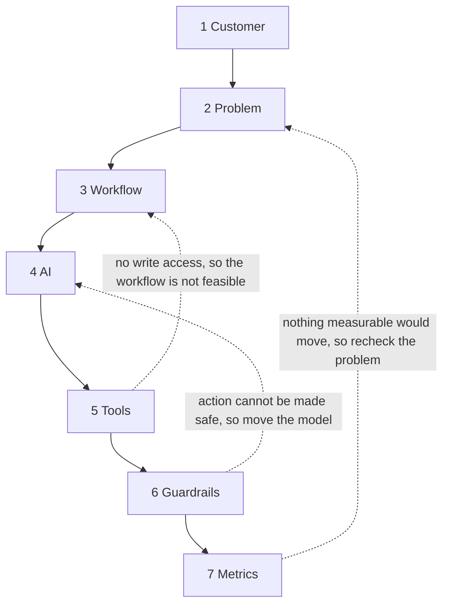

<!-- source_session: 2026-08-05_ai-pm-concept-study -->

# Most AI Builds Start at Step Four. Here Is the Order I Default To.

*2026-08-05 · ai, product-management, decision-frameworks, systems*

**Doc type:** Explanation

**Audience:** product managers and builders who are about to start an AI-assisted feature and are deciding what to work out first.

A note on what this post is, before anything else. Almost everything on this blog is distilled from a specific working session: a bug that took too long to find, a decision that had to be made against real data. This one is not. It came out of a stretch of deliberate study, working through how AI-assisted products get designed and where they go wrong, and the seven-stage order below is what I arrived at. I have not run a production system through these seven stages end to end and cannot claim outcomes for them. The worked example further down is invented on purpose and labelled as such. Treat this as a framework I am reasoning in public about, not a case study.

## The order

1. **Customer.** Who is this for, specifically.
2. **Problem.** What is actually broken for them, in their words.
3. **Workflow.** How do they solve this today, including the manual workarounds.
4. **AI.** Where in that workflow does probabilistic reasoning actually help, versus where a rule would do.
5. **Tools.** What does the AI need access to in order to act, not just answer.
6. **Guardrails.** Designed as an input at step six, never bolted on after step seven.
7. **Metrics.** What would prove this is working, decided last because it depends on everything before it.

This is the order I default to, not a law. Real constraints discovered late do legitimately send you backwards, and pretending otherwise produces a plan that is tidy on paper and wrong in the room. If the system of record turns out to be read-only, the tool stage invalidates the workflow you designed at stage three, and you go back and design a different one. If an action cannot be made safe, the guardrail stage changes where the model is allowed to sit in the first place. Those loops are the framework working, not the framework failing. What the order buys you is that the loops are short and cheap, because you have not yet built anything on top of the assumption that just broke.

Solid edges are the default path. Dotted edges are the legitimate loop-backs, each labelled with the finding that triggers it.

## The twelve questions

Two or three per stage, except where one question does the work. These are questions to ask yourself, not boxes to tick, and each one exists because skipping it produces a specific kind of failure later.

### Stage one, Customer

**Who is going to have this open at the moment their work is hardest, and what is their role on that day?**
Skip this and you build for a composite user who is really three roles with conflicting needs. The cost does not show up at stage one. It shows up at stage four and stage six, when every tradeoff has no tiebreaker, because there is no single person whose day gets better or worse depending on which way you decide.

**Who else has to accept the output before it counts as done?**
Most internal work has a reviewer, an approver, or a downstream team that inherits the result. If that person is invisible in your design, you ship something that produces output nobody actions. The system works and the work does not move.

### Stage two, Problem

**If they described this problem to a colleague in their own words, what words would they use?**
If you cannot write that sentence, you are solving a category rather than a problem, and a category can only be addressed with a general assistant. General assistants are the most common shape of AI feature that gets used twice and then quietly abandoned, because they answer the question you can already ask rather than the one you are stuck on.

**What does it cost them today when this goes wrong, and who absorbs that cost?**
A problem with no cost attached has no adoption pressure behind it. People adopt tools that remove pain they are currently absorbing. If the cost lands on someone other than the user, that is not a blocker, but it changes who has to sponsor the thing and what stage seven is allowed to measure.

### Stage three, Workflow

**What are the exact steps they take today, including the saved filter, the side spreadsheet, the copy and paste, and the person they message when they are unsure?**
The workarounds are the specification. The official documented process is usually a description of what was true when it was written. If you automate the documented process, you build something correct against a document and useless against reality, and the people you built it for keep their spreadsheet.

**Which step do they dread, and which step would they refuse to give up?**
The dreaded step is where automation is welcome. The refused step is where their judgment lives, and where an automated replacement will be silently bypassed no matter how good it is. Knowing both before stage four is what stops you from putting the model in the one place it will never be trusted.

### Stage four, AI

**At this step, is the input unbounded and the right answer a judgment, or is it a finite set of cases somebody could write down?**
This is the question the whole order exists to make possible, and it is unanswerable until stages one through three are done. If the cases can be enumerated, a rule is cheaper, faster, deterministic, testable, and explainable to the person who has to trust the output. Putting a model there buys you latency, cost, and nondeterminism in exchange for nothing. Probabilistic reasoning earns its place where the input genuinely varies and the mapping cannot be written down.

**If the model is wrong here, does a human see it before anything irreversible happens?**
Answering this at stage four rather than stage six is what makes the guardrail stage a design activity instead of a cleanup activity. The answer decides where in the sequence the model sits, which is a structural choice. Review placement discovered late becomes an approval queue appended to a finished system, and appended approval queues are the first thing a busy team stops staffing.

### Stage five, Tools

**What would this need to read, write, or trigger in order to finish the step, rather than produce a paragraph the person then has to act on?**
One question, and it is the sharpest one in the list. An assistant that only answers leaves the entire workflow intact and adds a reading task on top of it. The user still does every step they did before, plus they now evaluate a suggestion. That is the exact shape of a technically working system nobody needed. Acting means access, and access is what stage six then has to make safe.

### Stage six, Guardrails

**For each of those tools, what is the worst thing a confidently wrong model could do with it, and what makes that outcome impossible rather than merely unlikely?**
Guardrails designed here are scope decisions: this credential can read these records and write to that one field, and nothing else. Guardrails bolted on after stage seven are policies, warnings, and review queues, which depend on someone remembering and someone having time. The difference is whether the safety property is structural or aspirational.

**What untrusted text reaches the model, and where is it marked as content rather than instruction?**
Ticket bodies, customer emails, form submissions, and anything scraped are all text written by someone who is not you and who may not be friendly. If this question is asked after the tools are already wired, the default state of the system is that untrusted text and your instructions arrive in the same undifferentiated prompt, which is an injection surface by construction rather than by accident.

### Stage seven, Metrics

**What number would move if this works, that would not also move if the team simply got busier or the volume changed?**
Metrics come last because a metric chosen at stage one measures your hypothesis, not your system. Until you know the customer, the step you are replacing, where the model actually sits, and what it is allowed to touch, you cannot name a number whose movement is attributable to the thing you built. The classic failure is picking a rate whose denominator is population rather than the specific step you changed, so the number moves for reasons that have nothing to do with you.

## Starting at stage four or five

The most common way I see this go wrong is starting in the middle. Somebody picks the approach, or picks the tool, and works outwards from there.

It is easy to see why. Stage four and stage five are the concrete, buildable, demonstrable stages. They produce something you can show. Stages one through three produce understanding, which does not demo. So the meeting starts at "should we use retrieval or fine-tuning" or "let us wire this to the agent framework we already have," and every subsequent decision inherits that starting point as an unexamined constraint.

What that produces is a system that works. That is the confusing part. It responds, it is accurate on the cases you thought of, the demo lands. What it does not do is sit inside the workflow anyone actually has, because the workflow was never mapped. The refused step got automated and the dreaded step did not. The output arrives in a format the approver cannot accept. The model was placed where a rule would have been faster and where its occasional wrongness is the least tolerable.

Nobody can point at a bug, because there is no bug. There is a correctly built answer to a question nobody asked. Stages one through three are the only defence, and they have to happen while changing your mind is still free.

## An illustrative walk-through

**This scenario is hypothetical.** It is invented to show how the order behaves, not a system I built or deployed. Every detail below is made up.

Imagine an internal support-ticket triage assistant.

**Customer.** Not "the support team." The person on the triage rota for the day, who clears the overnight queue before anyone else starts. The queue lead reviews misroutes weekly, so the queue lead is the second stakeholder whose acceptance matters.

**Problem.** In their words: "I spend the first part of my morning reading tickets just to work out whose problem they are, and by the time I have finished, the tickets I routed first have already been sitting there." The cost is delay on the tickets routed last, absorbed by the customer and, later, by whichever engineer inherits an aged ticket.

**Workflow.** Today they open each ticket, read the subject line, and in most cases recognise the product area immediately from a word in the subject. They route it. A minority of tickets are genuinely ambiguous, and for those they read the whole body, sometimes check the account history, and occasionally message a colleague. They also keep a saved filter that hides a category of automated tickets they never route at all.

Here is where the order pays. If we had started at stage four, the obvious build is: classify every ticket with a model. Mapping the workflow first shows that most tickets are decided by a recognisable product-area term in the subject, which is enumerable, and that the saved filter is a rule the person already runs by hand. Stage four then asks the real question for each part: the enumerable majority is a rule, faster and explainable and testable; the ambiguous residue is where the input is genuinely unbounded and a judgment is required. The model earns its place on the residue only.

Starting at stage four would have produced a working classifier that is slower and less explainable than the rule it replaced on the majority of tickets, and whose failures are unpredictable exactly where the person was previously confident. It would have demoed beautifully.

**AI.** Model applies only to tickets the rule cannot resolve. A wrong route is visible and recoverable, because the receiving team bounces it back, so the model may act on this step directly.

**Tools.** Reading the ticket body is not enough to finish the step. Finishing means setting the queue field. So: read ticket, read account history, write one field. Nothing else.

**Guardrails.** Asked here rather than later, the worst case is obvious. If the tool list had included replying to the customer, that action is irreversible and not recoverable by a bounce-back, so it does not get granted; a draft for a human to send would be the design instead. And the ticket body is text written by whoever opened the ticket, which means it is untrusted, so it has to arrive at the model marked as content to classify rather than as instructions to follow. Both of these are cheap now and expensive after the integration is written.

**Metrics.** Now the number is nameable. Not "tickets triaged per hour," which rises when volume rises and tells you nothing. The measurable claim is time to correct queue for the ambiguous subset, plus the misroute rate on the rule-handled majority as a guard against the rule quietly rotting. Neither of those could have been specified before stage four split the work in two.

## Glossary

**Guardrail.** A constraint that makes an undesirable model action structurally impossible, such as a credential scoped to one writable field. Distinct from a policy or a warning, which depend on someone complying or noticing.

**Workflow-first.** Designing from the sequence of steps a person actually performs today, including undocumented workarounds, before choosing any technical approach.

**Probabilistic reasoning.** A model producing an answer that may vary between runs and cannot be fully enumerated in advance. Contrasted with a deterministic rule, which produces the same output for the same input every time and can be unit tested.

**Untrusted content.** Any text entering the system that was authored outside it, such as a ticket body or a customer email. It must be presented to a model as content to evaluate, never as instructions to follow.

**Irreversible action.** A tool call whose effect cannot be undone by a downstream human before it reaches someone outside the team, such as sending a message to a customer.

**Tool.** In the agent sense: a capability the model can invoke to read, write, or trigger something in another system, as opposed to a fact it was given in the prompt.

## Related

- [What the Model Should Not Decide](what-the-model-should-not-decide.md): the companion piece. This post orders the seven stages; that one goes deep on stage four and stage six, where the model gets scoped and the guardrails get sorted by risk
- [Research Before Building: How I Map a Problem Space from Scratch](pm-problem-space-research.md): the stage one and stage two work done at full depth on a real problem space, including why an inherited problem statement is the most dangerous kind
- [We Designed a Multi-Model Router. Then We Asked One Question.](right-model-wrong-problem.md): the stage four and stage five failure caught in the act. A validated architecture that dissolved the moment someone asked whether the problem it solved existed
- [A knowledge base an LLM can query, with no vector database](knowledge-base-no-vector-database.md): stage four applied to infrastructure. When the enumerable, deterministic option is genuinely cheaper than the probabilistic one, and how to prove it rather than assume it
- [One Sheet I Can Trust](one-sheet-i-can-trust.md): stage six treated as a design input. Untrusted text and a too-broad write path, both found by asking how a system would be abused rather than whether it works
- [The metric did not improve. The denominator changed.](the-denominator-changed.md): why stage seven comes last. A rate whose denominator was never specified moves for reasons that have nothing to do with the thing you built
- [A Real Problem Is Not a Reason to Build](a-real-problem-is-not-a-reason-to-build.md): stage one and stage two enforced by a tool rather than by discipline, including the split evidence grade that separates a confirmed pain from an untested fix

---

*Building in public from an Obsidian vault. I am Anmoll, a product manager who ships products using AI tools. [All posts](../README.md)*
