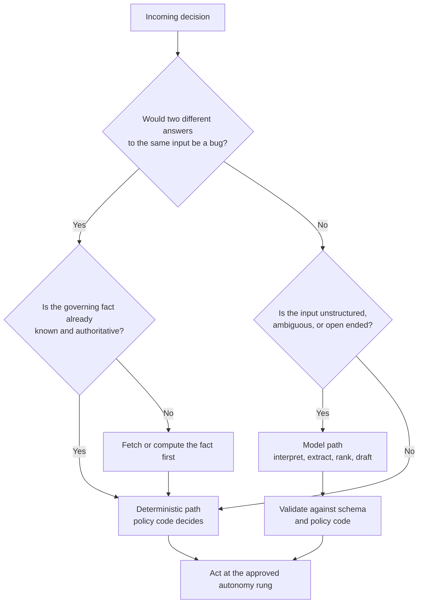
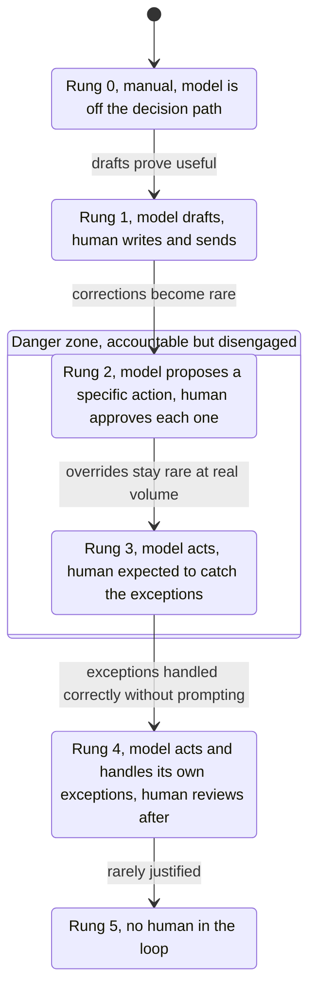

<!-- source_session: 2026-08-05_ai-pm-concept-study -->

# What the Model Should Not Decide

*2026-08-05 · ai, product-management, systems, ai-agents*

**Doc type:** Explanation

**Audience:** Product managers and engineers deciding how much of a product's decision-making to hand to a language model, and where to put the boundaries.

A note on what this post is, because the rest of this blog does not work this way. Almost every post here is distilled from a working session: a bug I chased, a system I rebuilt, a decision that had a commit attached to it. This one is not. It is a framework I have been working through during a period of deliberate study on how AI gets scoped inside products, and I have not run a production deployment of the thing I am describing. There are no measured results in this post because I have not measured anything. It is a set of positions I hold and would defend, not a set of outcomes I have booked. Read it as an argument, not a report.

The argument has four parts that keep turning out to be the same argument.

---

## Part 1: Do not agentify everything

The reflex right now is to take a workflow, notice that a model can do most of it, and hand the model the whole thing. The step that gets skipped is the one where you separate the parts of the workflow that need judgment from the parts that need to be right.

Here is the test I use, and it is not subtle. **Ask the same question twice. If two different answers would be a bug, it is not a model decision.**

That single line sorts most systems. Consider a group expense app where somebody types "Rahul covered the drinks, split the food four ways, and take my share of the cab off what he owes me". A model is very good at reading that sentence. Turning messy human phrasing into structured intent is precisely the thing that was hard before models existed and is easy now. What the model should hand back is a structure: who paid, what category, which split rule, which adjustment. What the model should never do is the arithmetic. The moment a settlement figure comes out of a probability distribution instead of out of code, you have a ledger that occasionally disagrees with itself and no way to know which run was the wrong one. A model that is usually right about arithmetic is a calculator that is sometimes wrong, and it will not raise its hand on the times it was.

The same split holds everywhere I have looked:

- **Entitlement checks.** Whether this account's plan includes this feature is a lookup against a table. It is not a judgment call, and there is no version of "the model considered the plan tier" that beats reading the row.
- **Pricing and discount stacking.** Whether two promotions combine, and in which order, is policy. Policy is code. If the answer depends on which words happened to be in the prompt, you do not have pricing, you have a suggestion engine attached to a payment processor.
- **Tax math.** Rate by jurisdiction, rounding rules, what is taxable. This is the category where being approximately right is indistinguishable from being wrong.
- **Refund windows.** Purchase date plus policy period against today. Known values and a comparison.

And the mirror list, the work the model should absolutely own: reading unstructured input, extracting fields from free text, classifying something genuinely ambiguous, ranking options where the ordering is a matter of fit rather than fact, drafting a reply, summarizing a thread, explaining a decision back to a person in their own words.

The pattern underneath: **use the model for interpretation, use code for consequences.** The model decides what the person meant. Code decides what happens.

---

## Part 2: Sometimes the guardrail is deleting the model from the decision

The default move when a model does something wrong is to prompt it harder. Add a rule. Add an example. Add emphasis. Tell it to be careful.

Consider what that actually is. You have a decision with a known correct answer, and you are patching it with a probabilistic instruction and hoping the probability lands your way often enough. You have not removed the failure. You have made it rarer and harder to reproduce, which is a strictly worse property than a failure that happens reliably.

The alternative: when the fact that governs a decision is already known and authoritative somewhere in your system, do not ask the model about it at all. Look it up, evaluate the policy in code, and hand the model the outcome as a given.

Refund eligibility is the cleanest example I know. The weak design puts the policy in the prompt: here is the customer's message, here is our refund policy, decide whether they qualify, and please be careful about the date. The strong design never asks. Code reads the purchase date, code applies the window, code produces a boolean. The model receives that boolean as a fact it cannot argue with, and its job shrinks to what it is genuinely good at: understanding what the customer is upset about and writing a reply that sounds like a person wrote it. The model cannot be careless about eligibility because eligibility was never in its hands.

That is what I mean by deleting the model from the decision. Not weakening it. Removing it from that specific hop.

### Where this reasoning turns into an excuse

I have to be honest about the failure mode of everything I just wrote, because it is a real one and I have watched myself drift toward it.

Every decision has a deterministic core if you squint hard enough. Push this principle far enough and you have carved out so many hops that the model is left holding nothing but phrasing, and you have shipped a rules engine with a chat skin on it. Worse, you never learn the thing you can only learn by putting a model on a real decision and watching how it fails: which edge cases it actually gets wrong, how it degrades, whether the failure is loud or quiet. That knowledge is not available from a design document. It is only available downstream of shipping.

And here is the uncomfortable part. Disciplined and scared produce the same architecture diagram. From the outside, the team that correctly routed a decision to policy code and the team that was too nervous to put a model anywhere near a customer look identical. Both can point at a clean deterministic path and call it rigor.

I do not have a clean resolution to that, and I am suspicious of anyone who offers one. The closest thing I have to a practice is to write it down: which decisions are deliberately deterministic, which are deliberately model-owned, and which are deferred with a date attached to the deferral. Naming it does not resolve the tension. It just stops the cautious default from winning silently, every time, without anyone having argued for it.

---

## Part 3: The autonomy ladder

The second reflex worth killing is treating autonomy as a setting. A checkbox in a config file, flipped when someone decides the system seems ready.

Autonomy is not granted. It is earned, one rung at a time, against demonstrated reliability on the specific class of decision in question. A system that has proven it can draft well has proven nothing about whether it can act.

**This ladder is adapted directly from the SAE International levels of driving automation, levels zero through five, which is a real, published standard for road vehicles.** It is not an established taxonomy for AI agents, and I am not presenting it as one. I am borrowing its shape because the underlying problem is genuinely the same: grading a handover of responsibility between a machine and a human across a scale, rather than treating it as an on-off switch. Treat what follows as an analogy I find useful, not an industry standard.

The interesting claim is not that the ladder exists. It is that **the middle rungs are the most dangerous place to sit**, and the driving analogy is exactly why I believe it.

Driver-assistance research has documented the handoff problem for years, and it is one of the better-established findings in the field. A system that is good enough to handle most of the driving trains the person behind the wheel to stop watching. Then it hands control back at precisely the moment that attention was most needed, to a person whose attention has been decaying for the last stretch of road. The human is still nominally accountable the entire time. The human is no longer actually engaged. Those two facts coexisting is the whole problem.

Software has the same shape and gets less scrutiny for it. A rung 2 system with a "select all, approve" button is a rung 4 system wearing a costume. The approval ceremony is still there, so the accountability story still reads well in a design review, but nobody is reading the proposals. That is worse than having no human in the loop, because everyone downstream now believes somebody looked.

Two things follow, and they are the practical payload of this section:

**Make the middle rung expensive for the machine, not for the human.** Show the actual diff, not a summary of the diff. Require a decision that cannot be made without reading the content. If your approval step can be satisfied by clicking without comprehending, it is not oversight, it is a signature line.

**Treat rung 3 as a corridor, not a room.** It is the rung you pass through while gathering evidence about exception handling. A system parked at rung 3 indefinitely carries all the risk of autonomy and all the cost of supervision, and it is stable there precisely because it feels safe to everyone involved.

---

## Part 4: The buckets I sort guardrails into

"Guardrail" has become a word that means whatever the speaker wants it to mean, which usually turns out to be output validation. So here are the buckets I personally sort them into. This is my own sorting, not a canonical taxonomy, and the point of the buckets is entirely the comparison between them.

**Data access.** What the model is allowed to see. Least privilege, scoping to the right tenant or account, redacting secrets and personal data before anything reaches the prompt. Failures here are disclosure failures, and they are silent by construction.

**Tool and action.** What the model is allowed to do. An explicit allowlist of callable actions, previews and dry runs before anything destructive, caps on blast radius, idempotency so a retry does not double-charge somebody, and a hard stop requiring a human for anything irreversible. Failures here cost money, delete things, or send something to a customer that cannot be unsent.

**Policy rules.** What must be true regardless of what the model produced. This is Part 1 and Part 2 expressed as an enforcement layer: deterministic checks that run after the model and before the action, failing closed when they cannot evaluate.

**Output format.** Schema validation, parsing, retries on malformed responses, refusing to act on a shape you did not expect.

**Human in the loop.** Who gets asked, when, and critically, what they are shown when asked. This is where the middle-rung problem from Part 3 either gets engineered around or gets papered over.

Now the actual point.

**Most teams over-invest in output format and under-invest in tool and action.** The reasons are not mysterious. Output validation is visible, easy to test, satisfying to fix, and it fails loudly and often during development, so it gets attention early and keeps it. It is also the bucket every tutorial covers. Tool and action guardrails, meanwhile, defend against events that are rare, so nothing about the development experience creates pressure to build them.

But the severity distributions are inverted. A malformed JSON response is a caught exception and a retry. An unbounded action is a refund issued to the wrong account, a bulk update against production, a message sent to a customer list. The bucket that fails frequently and cosmetically gets the investment. The bucket that fails rarely and catastrophically does not.

### Making guardrails measurable

A guardrail you cannot measure is a claim. What follows are **the metrics I would want to see** on a system like this. I want to be exact about the status of this section: I have not run this instrumentation, and I am not reporting numbers from anywhere. This is what I would ask a team to put on a dashboard, and what I would look for once it existed.

- **Override rate.** How often a human reverses or edits what the model proposed. This is the readiness signal for climbing a rung.
- **Blocked-action rate.** How often a guardrail actually stopped something. A rate sitting at zero means one of two very different things: the guardrail is unnecessary, or it is not wired up. Those look identical on a dashboard and are worth distinguishing before you trust it.
- **Automation rate.** The share of cases completed without a human touching them. This is the value signal, and it is the one most likely to be gamed.

The reading matters more than the collecting. Automation rate climbing while override rate holds steady is a system genuinely getting better. Automation rate climbing because someone quietly lowered a confidence threshold is the same chart with the opposite meaning. If you only instrument the number that looks like progress, you will get a number that looks like progress.

---

## Glossary

- **Deterministic path.** A decision route where the same input always produces the same output, implemented in code rather than in a model. Arithmetic, lookups, policy evaluation.
- **Guardrail.** A constraint that limits what an AI system can see, do, produce, or decide without a human. Enforced in code around the model, not requested inside the prompt.
- **Autonomy rung.** A single level on a graded scale of how much a system may act without human involvement, adapted here from the SAE driving-automation levels.
- **Blast radius.** How much can go wrong from a single bad action. The quantity a tool guardrail is trying to bound.
- **Fail closed.** When a check cannot be evaluated, the action is denied rather than allowed. The opposite, failing open, turns an outage in your guardrail into an outage in your policy.
- **Override rate.** How often a human reverses or edits a model's proposed action.
- **Blocked-action rate.** How often a guardrail prevented an action from executing.
- **Automation rate.** The share of cases completed end to end with no human involvement.

---

## The single idea

All four parts collapse into one sentence: **decide what the model is for, in writing, before you decide what it is allowed to do.**

Everything else follows. Interpretation is a model job and consequences are a code job, which is Part 1. When the governing fact is already known, route around the model entirely, which is Part 2. Acting on the world is a privilege earned against evidence rather than a configuration value, which is Part 3. And the guardrails that matter are the ones standing between the model and an irreversible action, not the ones checking that the braces balanced, which is Part 4.

The tension I flagged in Part 2 does not go away by writing any of this down. I would rather leave it visible than pretend a framework resolved it.

## Related

- [Most AI Builds Start at Step Four. Here Is the Order I Default To.](the-order-you-build-ai-in.md): the companion piece from the same period of study, covering when to reach for a model at all, where this post covers what to do once you have
- [One Sheet I Can Trust](one-sheet-i-can-trust.md): the tool and action bucket in a real system, a pipeline deliberately scoped to stop before the irreversible step, plus a prompt-injection probe showing why untrusted input needs a policy layer and not a stern instruction
- [We Designed a Multi-Model Router. Then We Asked One Question.](right-model-wrong-problem.md): the same scoping discipline one layer up, where the question is not which model but whether the model belongs in this decision at all
- [A knowledge base an LLM can query, with no vector database](knowledge-base-no-vector-database.md): the deterministic-beats-clever argument applied to retrieval, where a generated index and a human-written summary line replaced infrastructure that had not been sized yet
- [When the AI Fix is Wrong: What Senior Review Catches That Pattern Matching Misses](when-the-ai-fix-is-wrong.md): what happens when a model is handed a decision that needed a traced data path, four fixes that looked right in isolation and were wrong in context
- [Claude Appends Text After JSON: A Silent Bug Across 8 API Call Sites](claude-appends-text-after-json.md): the output-format bucket failing in production, and a good illustration of why it is the visible, easy bucket rather than the dangerous one
- [A Real Problem Is Not a Reason to Build](a-real-problem-is-not-a-reason-to-build.md): the decision one step earlier. Before scoping what the model owns, a check on whether the thing being scoped should exist at all

---

*I am Anmoll, a product manager who ships products with AI tools and writes about the systems behind the work. This post is a framework from a period of study rather than a session log. [All posts](../README.md)*
