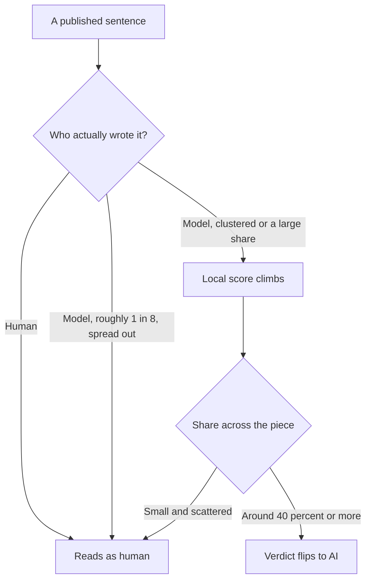

<!-- source_session: 2026-08-31_human-writing-standard-pangram -->

# The Detector Scored Who Wrote It, Not How It Was Written

*2026-08-31 · ai, writing, detectors, product-management*

**Doc type:** Explanation

**Audience:** Anyone publishing AI-assisted writing on a platform that runs a detector, and product people deciding where a language model belongs in a content pipeline.

My writing kept coming back as a machine. Not on a feeling. On a score. Substack runs an AI detector called Pangram, and drafts I had spent real time on read as one hundred percent AI. That is not a vanity problem. A cold-open essay that trips a detector loses the reader who came to trust a person, and on some platforms it loses distribution before a human ever sees it.

So I stopped guessing and bought data. A free Pangram account gives you fifteen credits, one credit per hundred words. I spent ten of them in one sitting, running the same kind of text through the classifier over and over, changing one variable at a time. The result reframed the entire problem, and it was not the reframe I went in expecting.

## What I thought the lever was

The common belief is that AI writing gets caught on style. Robotic rhythm, the same tell-tale words, sentences all the same length. Fix the style, the theory goes, and you pass. There is a small industry of "humanizer" tools built on exactly that premise.

I had a better version of the theory. I have a house writing standard, built the same week from a teardown of how these detectors work: vary sentence length hard, put a real number or a named brand early, drop in a genuine complaint, cut every word on the banned list. Written prose that reads like a person, by construction.

So the first test was fair. One piece written in flat default-AI style, one piece written to the full standard with everything turned up. Short sentences next to long ones. A named coffee brand. A loud laptop fan. A real gripe about the work.

Both scored one hundred percent AI. The engineered one did not move the needle a single point.

## The test that changed the question

A detector that flags everything is useless, so the honest next step was to check whether it flags real human writing too. I pulled two passages no classifier should dare touch: a paragraph of George Orwell from 1946, and an excerpt from a Paul Graham essay from 2013. Both came back one hundred percent human.

That is the whole finding in one line. The detector was not scoring how the words were arranged. It was scoring who arranged them.

To be sure it was authorship and not some quirk of those two passages, I ran a dose. I took the human Paul Graham paragraph and had Claude reword three of its eight sentences, keeping them clustered in one place. Score: seventy-four percent AI, verdict "Mixed," and Pangram highlighted the exact three sentences the model had touched. Then I reset and had Claude reword only one sentence in eight. Still one hundred percent human.

The model's fingerprint is not in the vocabulary. It is in the sentences themselves, and the detector reads them one at a time with a sliding window, which is why three reworded sentences sitting together lit up a whole region while one on its own vanished into the human majority.

## The product decision underneath

Strip away the detector and this is a scoping question I have written about before in another form: decide what the model is for, then decide what it is allowed to do.

There were two roads out of that test session. The first was to keep hunting for the magic edit, the styling trick that finally beats the classifier. That road is a treadmill. Pangram publishes that it catches humanized and paraphrased AI output around ninety-nine percent of the time across more than a dozen commercial rewrite tools. Optimizing against a classifier whose entire job is to catch the trick you are about to try is a losing trade, and it was losing before I started.

The second road was to change who writes the sentences. Not to fire the model. To move it off the one job it cannot do without leaving a fingerprint. The model is genuinely good at the surrounding work: pulling sources, arguing the outline, catching a banned word, telling me a paragraph is weak and why, drafting a version I then throw away and rewrite in my own hand. What goes on the page, on the platform that scores it, has to be mine. The tolerance is real but small. About one model-written sentence in eight disappears, and even that held only on short text where the detector itself flagged low confidence, so I treat one in eight as a ceiling I rarely spend, not a budget I aim to fill.

That is the same shape as every good AI scoping call I know. Use the model for interpretation and support. Keep the consequence, here the authored sentence, under human control.

## Yes, a detector would flag this post

I will not pretend otherwise. This post was drafted with the same tools, and if you ran it through Pangram it would come back AI. That is not a contradiction in the argument. It is the argument.

This blog lives on GitHub. Nothing here scores me, and the only judge is the person reading, which is why the house standard for a page like this is about being readable and specific and honest, not about beating a machine. The place where the machine votes is my Substack, and that is the exact place I do the thing this post is recommending: I write the sentences. The rule is not "never let a model near your writing." The rule is to know which surface has a detector on it, and to spend the model's help everywhere except the sentences that surface will score.

## The part that should make you uneasy

There is a cost buried in all of this, and it is not mine to wave away. These detectors do not actually measure authorship. They measure a statistical fingerprint and call it authorship, and the fingerprint of fluent, evenly-drafted English is not unique to machines.

A 2023 Stanford study by Liang and colleagues found that GPT detectors flagged the majority of TOEFL essays written by non-native English speakers as AI, while clearing essays by native speakers. A clean, careful writer who learned English second reads, to one of these tools, exactly like the thing I was trying to defeat. OpenAI quietly retired its own text classifier for being unreliable in both directions. So when a platform gates distribution on a detector, it is not only catching the people gaming it. It is taxing a real and specific group of humans for writing well in a second language.

I do not have a clean resolution to that, and I am wary of anyone who offers one. What I have is a smaller, honest claim, sized to what I actually tested. On a surface that scores you, provenance beats style, so write the sentences yourself. On a surface that does not, forget the detector and write for the person. And keep a clear eye on the fact that the tool doing the scoring is confidently wrong about a lot of real people, which is the best reason of all not to build your writing around pleasing it.

## Glossary

- **AI detector.** A trained classifier that estimates whether text was written by a language model. Pangram is the one Substack runs. It scores sentence by sentence rather than judging a document as a whole.
- **Provenance.** Who actually produced a given sentence. The finding here is that the detector tracks this far more than it tracks writing style.
- **Sliding window.** Scoring text in overlapping local chunks rather than as one block, which is why model-written sentences clustered together raise the score faster than the same number spread out.
- **Humanizer.** A tool that rewrites AI output to try to pass a detector. The category these classifiers are now trained specifically to catch.
- **False positive.** Human writing scored as AI. Documented at scale for non-native English writers, and the reason a detector is a filter to respect, not a truth.

## Related

- [What the Model Should Not Decide](what-the-model-should-not-decide.md): the same scoping discipline in a different domain, where the rule was to use the model for interpretation and keep consequences in code. Here the consequence is the authored sentence.
- [The Eval Was Grading My Config, Not My Skill](the-eval-was-grading-my-config.md): another case where a measurement was scoring a different axis than I assumed, and the fix started with proving what the number actually tracked.
- [The Guard I Built, Measured, and Deleted](the-guard-i-measured-and-deleted.md): the same habit of running a check against real data before trusting it, and being willing to let the measurement overturn the plan.

---

*I am Anmoll, a product manager who ships products with AI tools and writes about the systems behind the work. This one came from a session spent testing a detector until it told me something I did not expect. [All posts](../README.md)*
