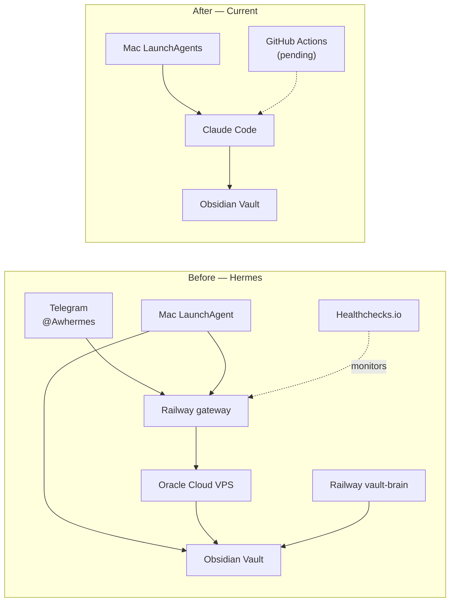

<!-- source_session: 2026-06-29_hermes-shutdown-postmortem -->

# Why I Shut Down Hermes — a Multi-Agent AI System I Built Myself

*2026-06-29 · ai, systems, automation, vault, engineering*

The most sophisticated AI system I have ever built myself is now offline. Not because it broke. Because the overhead of keeping it alive exceeded the value it was delivering — and I could see exactly why.

This post is the honest accounting.

---

## What Hermes Was

For context: Hermes was a multi-agent orchestration system I built alongside my Obsidian vault — the Markdown knowledge base where my entire working life lives. The wave-by-wave build is documented in the Hermes as a PA series. This post steps back and explains the shutdown.

The system had five components.

A **gateway service** ran on Railway, a cloud platform for deploying server workloads. The gateway was a multi-model router with pluggable toolsets: it handled automations, routed model calls to Claude, Gemini, and models via OpenRouter, and was the entry point for commands coming in through the Telegram bot.

A **vault-brain service**, also on Railway, was a nightly Python job that wrote lessons, reflections, and health summaries directly into the vault — structured Markdown that appeared alongside my own notes when I opened the editor the next morning.

A **.brain reflector** was a GitHub Actions cron job designed to implement a closed measurement loop. Sessions would generate observation logs. The vault-brain would extract patterns from those logs and turn them into lesson files. The reflector was supposed to measure whether each lesson actually shifted behavior in the intended direction in subsequent sessions — scoring lessons as helped or misled, evicting weak ones, promoting strong ones. The goal was a lesson corpus that got smarter over time rather than just growing.

A **Mac LaunchAgent** ran the finance pulse and synced memory files to a virtual private server, or VPS, hosted on Oracle Cloud Infrastructure. The LaunchAgent handled the local side of the data pipeline.

A **Telegram bot** — registered as @Awhermes — was the interactive interface. Text it a command, and it fired the relevant automation through the gateway.

Monitoring ran through Healthchecks.io: a dead-man's-switch pattern where the system pinged an external watchdog continuously, and silence meant failure.

---

## The Feedback Loop That Made It Worth Building

The reason I built all of this rather than just scheduling some scripts was the closed feedback loop. Most scheduled AI systems are memoryless. A cron job fires. Claude reads some files. Claude writes output. The job ends. Tomorrow the same job fires with zero memory of what happened yesterday. It re-evaluates everything from scratch and makes the same calls it made last week.

Hermes was designed differently. A session would generate observation logs. The vault-brain would extract patterns from those logs and write them into lesson files. The next session would load those lesson files as behavioral context — instructions from prior runs, not blank context. And then the reflector would measure whether each lesson actually changed behavior in the intended direction, score it, and evict lessons that consistently misled.

The vision was a lesson corpus that compounded. Bad lessons would die. Good lessons would survive and sharpen. Every session would leave the system slightly more effective than it found it.

Combined with automated vault intelligence — nightly inbox processing, pattern synthesis, finance snapshots, nightly reflections — and multi-model routing that could dispatch different tasks to different models, the architecture was genuinely capable in the periods it ran cleanly.

The question is always: how often did it run cleanly?

---

## Why I Shut It Down

The honest reasons, in the order they mattered.

**Maintenance overhead exceeded value.** Railway bills, the Oracle Cloud VPS, Telegram bot upkeep — these were background costs in time and money. But the more expensive cost was cognitive. Almost every session started with some version of: is the gateway up? is the vault-brain job in a failed state? did the VPS restart overnight? That is not a morning briefing. That is firefighting with extra steps. The system was generating overhead before it generated value.

**Split-brain corruption risk.** The Mac and the Railway gateway competed to write to the same vault. The sync mechanism between them was not instantaneous — there was always a lag window where both sides held different views of the same files. When the gateway wrote a lesson file and the Mac sync had not yet caught up, the merge produced corrupted state. This happened at least once and was expensive to debug. That is the worst kind of bug: not a crash you observe immediately, but a quiet divergence you find only when something downstream breaks unexpectedly.

**The reflector loop was never fully operational.** The GitHub Actions reflector — the piece that would have closed the measurement loop — was planned and designed but never shipped. Without it, the "vault gets smarter over time" premise was incomplete. Lessons accumulated. Whether they helped was never measured. I was running the expensive distributed version of a system that was not yet delivering its core value proposition. The infrastructure was built around a feedback loop that did not yet exist.

**Claude Code plus Mac runners do the job.** The real value I was getting from Hermes was in the scheduled runners: morning briefing, inbox processor, pattern synthesis. These are now Mac LaunchAgents calling Claude Code directly via `claude -p`. They run with access to the full vault, they write directly to the same files, and there is no sync lag, no cross-machine write conflict, and no cloud service between the runner and the data. The VPS was solving a problem that a Mac you leave plugged in also solves, without the split-brain risk.

**Free-tier GitHub Actions can replace the scheduled jobs.** The one real advantage of an always-on server is that it fires on schedule whether or not the laptop is on. For that, GitHub Actions on the free tier is the right tool. No Railway service required. No VPS to maintain. The scheduled jobs that need to run regardless of machine state go there; everything else runs locally.

---

## What Replaced It

The current architecture is simpler by design.

Mac LaunchAgents call Claude Code for the core runners: morning briefing, inbox processor, pattern synthesis, weekly review. They run when the Mac is on. They write directly to the vault with no intermediary.

The jobs that need to be always-on are being migrated to GitHub Actions, where the free tier provides enough compute for scheduled jobs that read from and write to a vault synced via git. No Railway service required.

The observation synthesis runner — the local, operational successor to the reflector loop — runs every Sunday. It processes behavioral patterns from session tool-use logs, classifies them against the known pattern corpus, and surfaces candidates for review. It is simpler than what the reflector was designed to be. It is also actually running.

The Telegram bot is gone. The commands it handled are now either covered by the morning briefing directly, or they were commands I was not using as often as I had assumed when I built the interface.

---

## The Takeaway

Every product — including a side project you build for yourself — should pass one question: is this system solving the original problem, or is it spending most of its energy solving the problem the architecture creates?

Hermes, at its best, was solving a real problem. A brain I trusted needed an always-on body. But at the point I shut it down, a large fraction of the energy going into the system was going toward maintaining the system itself, not toward what the system was supposed to produce. The automation was automating its own upkeep.

The reflector is the clearest example. The most valuable piece of the entire architecture — the measurement loop that would have made every other piece compound over time — was the piece that never shipped. The infrastructure grew around a capability gap. That is a common failure mode in systems design, and it is easy to miss from the inside because the infrastructure itself looks like progress.

A simpler system that is fully operational beats a sophisticated system that is perhaps forty percent built. The Mac LaunchAgents plus Claude Code are not as architecturally interesting as multi-model routing through a Railway gateway with a nightly Python vault-brain. But they run, they deliver value every morning, and they do not start my day with a status check.

Shut it down. Build the simpler thing. Measure whether the simpler thing delivers the value. If it does not, now you know exactly what the more complex piece was for — and you can build it with a clearer specification than you had the first time.

---

## Related

- [Hermes, Wave 1: Giving My Vault an Always-On Body](hermes-the-foundation.md) — the foundation post for the system this post closes out; the data boundary, single-writer rule, and always-on design choices that the shutdown revisits from the other direction
- [How My Hermes Agent Works — and What It Does for Me, From a PM's Point of View](building-a-personal-ai-ops-layer.md) — the PM overview of the full system, with the value-first roadmap and the constraints-as-product-decisions framing; this shutdown is the next chapter of that story
- [The Write-Only Trap](the-write-only-trap.md) — the observation synthesis runner that is the local, operational successor to the reflector loop described here; what "actually running" looks like in practice
- [Every Status Was Green. Three of Them Were Lying.](every-status-was-green.md) — the vault-brain sync failure that is a direct, concrete example of the split-brain problem described in this post
- [AI Runners That Remember](ai-runners-that-remember.md) — the Mac-side runner memory architecture; the precursor to what now runs without the distributed infrastructure overhead

---

*This post is a postmortem on the Hermes multi-agent system. I build products with AI tools and write about the systems behind the work. [All posts](../README.md)*

<!-- FACT SOURCES
- Five Hermes components (Railway gateway, Railway vault-brain, .brain reflector on GitHub Actions, Mac LaunchAgent, Telegram bot @Awhermes) — session brief
- Oracle Cloud Infrastructure VPS — session brief
- Healthchecks.io dead-man's-switch monitoring — session brief
- Multi-model routing: Claude, OpenRouter, Gemini — session brief
- Closed feedback loop description (sessions, then observation logs, then pattern extraction, then lesson files, then scoring, then evict/promote) — session brief
- Split-brain corruption happened "at least once" and "was expensive to debug" — session brief exact language
- Reflector loop "never fully operational" / "planned but never shipped" — session brief exact language
- Current architecture: Mac LaunchAgents calling Claude Code directly via claude -p; GitHub Actions pending — session brief
- No fabricated cost figures, timelines, session counts, or scale numbers
-->
