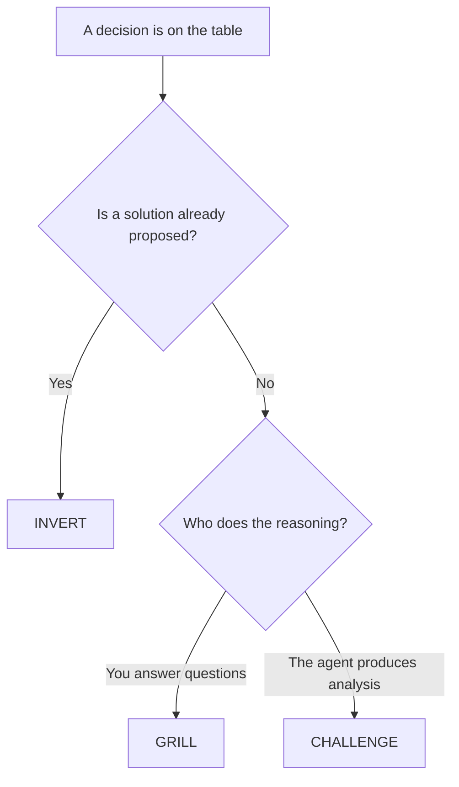

# decision-support

Three modes that apply pressure to a decision before you commit to it. Built for Claude Code, portable to any runtime that loads skills from a directory.

**Status: partially proven.** GRILL and CHALLENGE are consolidations of skills that ran for months. INVERT is new as of 2026-08-11 and has one recorded run behind it. A fourth mode, PREP, was retired on 2026-08-11, and the reasoning is in the honest limits at the bottom. Read those before you trust this with anything expensive.

Written for a reader who already uses an agent runtime and wants a working artifact rather than a framework.

## The problem this exists to solve

An agent will help you execute a decision far faster than it will question it. Ask it to build the thing and it builds the thing. The failure is not that the model is wrong; it is that nothing in the loop forces the two minutes of resistance a good colleague would supply. Under deadline, that resistance is exactly what a person skips.

So this is not a template library. It is a set of forcing functions. Each mode refuses to produce output until a specific kind of pressure has been applied, and each one ends with an artifact you can act on.

## The three modes

| You type | Mode | What it does |
|---|---|---|
| "grill me", "stress-test this plan" | **GRILL** | An interview. One question per turn, no exceptions, each built on your last answer. Ends with a written artifact: Resolved, Still open, Recommended next steps. |
| "devil's advocate", "pre-mortem", "red team", "test my assumptions" | **CHALLENGE** | The agent produces the analysis. Steelman your position first, then the three to five strongest attacks only, then synthesis. Five lenses: Socratic, pre-mortem, red team, falsification, dialectic. |
| "invert this", "what is the real problem here", "why do we need X" | **INVERT** | Takes a proposed solution as evidence rather than as a specification, and works backwards to the problem it implies. |

The overlap rule, which is the part people get wrong: **GRILL when you answer the questions. CHALLENGE when the agent answers them. INVERT when a solution already exists and the open question is whether it solves the right thing.**



## INVERT, in full

Seven steps. It refuses to skip any of them, and the refusal is the feature.

1. **Take the solution as evidence, not a specification.** Restate it in one line. Name the signal that probably produced it, such as a support pattern, a competitor move, or a personal frustration.
2. **Decompress to the underlying problem.** One sentence: who is stuck, on what, and what it costs them in trust, time, money, or retention.
3. **List three to five assumptions the solution bakes in.** Every row carries a risk if wrong and one check a human could run this week, naming the system and the query. Not "do more research."
4. **Generate three alternative framings** of the same underlying problem, each pointing at a genuinely different solution space. If all three collapse into variations of the same build, step 2 was still solution-shaped and gets redone.
5. **Grade evidence twice, separately.** *Problem evidence:* does the pain actually exist, and for whom. *Mechanism evidence:* has the causal story, that this change moves that behaviour, been tested anywhere. Each is real, partial, or none.
6. **Recommend once.** One framing, or an explicit kill. Never a menu.
7. **Draft the message** the original proposer can read without feeling blocked.

Step 5 carries the weight. A single blended grade lets a confirmed pain smuggle an untested fix through with it. Split in two, the most common honest outcome becomes visible: real problem, no mechanism evidence, which means the pain is confirmed and the fix is still a guess. That parks as a candidate hypothesis. It does not get built.

## Install

Copy the folder into your runtime's skills directory:

```bash
git clone https://github.com/Anmoll-W/decision-support.git
cp -r decision-support ~/.claude/skills/
```

The standalone repository is the canonical copy. This folder is a mirror kept in step with it.

For Codex, Copilot CLI, or Gemini CLI, `~/.agents/skills/` works as a cross-runtime alias. No dependencies, no build step, no API key. It is three Markdown files plus this README.

Then type one of the trigger phrases from the table above. The mode announces itself before it starts.

## What is deliberately not in this repository

`references/local-context.md` stays on the author's machine. It holds the filesystem paths and data-system names that are true only of one machine. The split is the point: `SKILL.md` is generic and publishable, and everything private lives in one file that a privacy guard keeps out of every publish. If you adopt this suite, write your own.

## Design notes

**Why one suite and not separate skills.** Narrow single-mode skills each get invoked twice and forgotten, which is what the retired fourth mode did on its own. These three share one job, applying pressure before commitment, so they share one entry point. The cost is real and worth naming: a suite is harder to discover than a single-purpose skill, and proving that cost took a full working session.

**Descriptions are the router, not the documentation.** A runtime decides whether to load a skill by reading its description. A description that summarises the workflow gets followed *instead of* the body, so this one names triggering conditions only and stops.

**Names travel without descriptions.** A subagent receives skill names with no description attached. No amount of rewording fixes that, which means agent and persona definitions have to name the skill and the mode explicitly. If you wire this into a multi-agent setup, wire it at that layer.

**Every mode ends in an artifact.** A challenge session that ends in a pile of objections is worse than no session, because it costs an hour and resolves nothing. Each mode has a required closing shape.

## Honest limits

- INVERT has one recorded run. Problem evidence partial, mechanism evidence none. By its own rubric that is a candidate, not a proven tool.
- A fourth mode, PREP, was retired on 2026-08-11. It applied no judgment pressure, which is the job the other three share. The deciding evidence was not its invocation count but its output: PREP mandated two signatures, a `Routing to:` line and a `CONFLICT:` block, and in the 39 days it existed as a mode it produced neither, 0 times, anywhere in the author's notes. A mode that leaves no trace of completing is not in use.
- The trigger phrases were regression tested against a fixture suite, and an over-breadth pass still caught two false positives that sentence anchoring had to fix. Expect to tune them for your own phrasing.
- None of this makes the agent right. It makes the agent slower at the exact moment being slower is worth something.

## Background

The story of how this suite turned out to be unreachable by the agents that were supposed to use it, and what the reachability audit found: [My Agents Were Calling Skills That Did Not Exist](../../posts/agents-calling-skills-that-do-not-exist.md).
